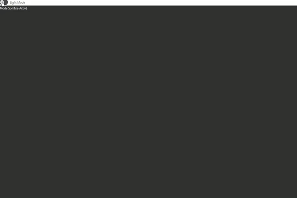

# darkmode

## Explication du projet

L'objectif de ce code est de l'améliorer pour l'intégrer à l'application shareish pour que celle-ci puisse bénificier de la fonctionnalité darkMode. 
Pour ce faire je fais des recherches de mon côté afin de pouvoir choisir la meilleur méthode d'implémenter ce darkmode au sein du projet.
Cette version est un première essai pour essayer de comprendre comment pouvoir modifier le style d'une page html depuis un élément (switch) provenant de buefy. 

Voici le composant utiliser : 


Donc ce composant est le composant utiliser dans le projet pour modifier le style de la page html.

Le code du composant ce trouve 


## Demonstration du projet




## Project setup
```
npm install
```

### Compiles and hot-reloads for development
```
npm run serve
```

### Compiles and minifies for production
```
npm run build
```

### Lints and fixes files
```
npm run lint
```

### Customize configuration
See [Configuration Reference](https://cli.vuejs.org/config/).
